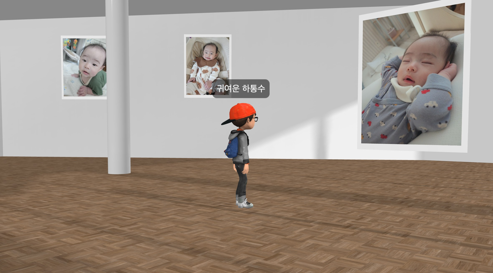
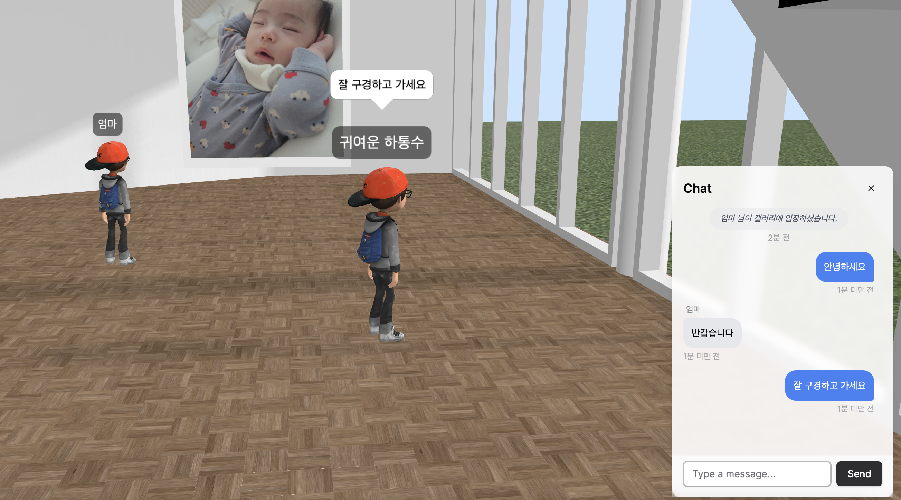
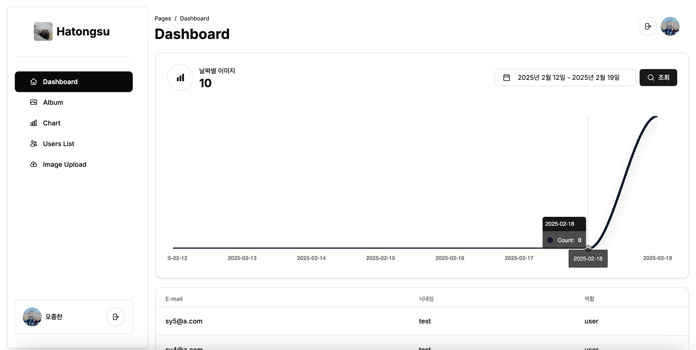
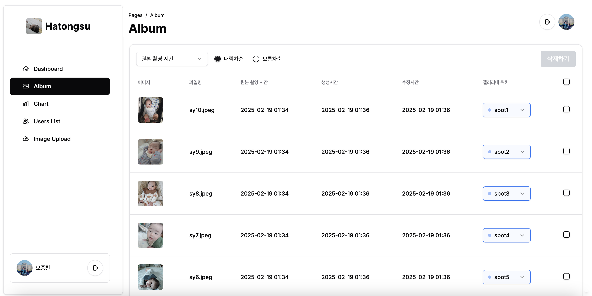

# Hatongsu Frontend

## Demo

[https://practice-zzingo.net](https://practice-zzingo.net)

## Architecture

- HTTPS: 웹 서비스 엔드포인트 및 API 통신
- WebRTC: 실시간으로 캐릭터 위치/회전 정보를 Low latency로 동기화
- WebSocket: 갤러리 내 실시간 채팅을 위한 양방향 통신
- RabbitMQ: 대량의 이미지 업로드 요청을 안정적으로 처리하기 위한 메시지 큐 시스템
- gRPC: 백엔드 마이크로서비스간 Protocol Buffers를 활용한 효율적인 데이터 전송

## Screenshot

  <h3>메인 페이지</h3>
  

    
    
  

  
  <h3>3D 갤러리</h3>
  

    
    
  

  <h3>대시보드</h3>
  

    
    
  

## Features

- [x] Next.js를 사용하여 웹 서비스 구축
- [x] Shadcn/ui 컴포넌트들을 활용하여 반응형 사용자 인터페이스 구현
- [x] Babylon.js로 인터랙티브한 3D 객체 렌더링 및 조작 기능 구현
- [x] React-query를 통해 서버와의 실시간 데이터 연동 구현
- [x] React-table로 데이터 정렬/필터링이 가능한 동적 테이블 구현
- [x] React-virtual을 활용한 대용량 데이터 무한 스크롤 목록 구현
- [x] Zustand로 UI 컴포넌트와 3D 객체 간의 상태관리

## My Project

|                                                 [Frontend](https://github.com/zzingobomi/hatongsu-frontend)                                                  |                                                 [Backend](https://github.com/zzingobomi/hatongsu-backend)                                                 |                                                   [World Server](https://github.com/zzingobomi/hatongsu-world-server)                                                    |                                                   [Event Server](https://github.com/zzingobomi/hatongsu-event-server)                                                    |                                              [Infra](https://github.com/zzingobomi/on-premise)                                              |
| :----------------------------------------------------------------------------------------------------------------------------------------------------------: | :-------------------------------------------------------------------------------------------------------------------------------------------------------: | :----------------------------------------------------------------------------------------------------------------------------------------------------------------------: | :----------------------------------------------------------------------------------------------------------------------------------------------------------------------: | :-----------------------------------------------------------------------------------------------------------------------------------------: |
|  |  |  |  |  |

## Credits

This project uses the 3D model **"The Mardou museum"**, which is licensed under [CC-BY-NC-4.0](http://creativecommons.org/licenses/by-nc/4.0/).

- Model: ["The Mardou museum"](https://sketchfab.com/3d-models/the-mardou-museum-daad27708791473eb3361401906492c0)
- Author: [OuterspaceSoftware](https://sketchfab.com/OuterspaceSoftware)

This work is based on "The Mardou museum" (https://sketchfab.com/3d-models/the-mardou-museum-daad27708791473eb3361401906492c0) by OuterspaceSoftware (https://sketchfab.com/OuterspaceSoftware), licensed under [CC-BY-NC-4.0](http://creativecommons.org/licenses/by-nc/4.0/).
